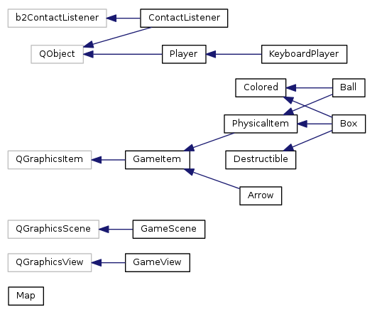

# Blockbuster - a 2D physics game

This was a [C++ programming project](https://github.com/hioa-cs/cpp_v2015/blob/master/prosjektoppgave/prosjektoppgave.md),
[I](http://github.com/matiashf) worked in in the spring of 2015. At
the beginning of the project I went through a [prototype
phase](prototype.md) and wrote a [project description
(Norwegian)](prosjektbeskrivelse.md).

## Building and running

```shell
sudo apt-get install qt5-qmake qtbase5-dev libbox2d-dev qt5-default g++ gdb libgtest-dev doxygen graphviz
qmake # Generate Makefile
make
bin/blockbuster
```

## Playing the game

Each player controls their ball with the keyboard. The objective of
the game is to destroy the other players boxes (the ones having
different colors than the players ball). Balls are indestructible, but
boxes are not. When the boxes take damage, they darken.

The game does not implement victory or loss conditions. When the two
players (sitting at the same keyboard) have decided on who won, they
can start a new game by exiting and starting the game again. After a
few games, the loser should buy the winner ice cream. Ties must be be
decided with rock-paper-scissors.

## Controls

Players controls their ball with an impulse vector represented in the
game as an arrow. They can rotate the arrow left and right, as well as
increase or decrease the desired impulse. To move the ball the player
hits a key to apply the impulse vector to the ball.

The first player uses arrow keys up, down, left, right and enter. The
second player uses WSAD (like in a shooter game) and space.

Additionally, the game state can be controlled with p pausing and
unpausing the game, Q quitting, F going to fullscreen, Escape going to
windowed mode and S stepping forward in time while the game is paused.

## Creating your own map

```shell
cp resources/maps/blank.txt mymap.txt
gedit mymap.txt # Make sure you use insert mode.
bin/blockbuster mymap.txt
```

To add new builtin maps (bundled with the executable file), create
files in the resources directory and regenerate `resources/resources.qrc`.

```shell
touch resources/maps/mynewmap.txt
cd resources
rcc -project | grep -v ./resources.qrc > resources.qrc
```

## Known issues

* Sporadically, the game shows a transparent window when started. I
  have not been able to consistently reproduce the cause of this or
  track it down. Fix: Press escape, close the window and run the game
  again.
* If you create maps with the ball at the far right side of the map,
  it can fall outside the world edges.
* The arrows can be moved even though the game is paused.
* Exceptions from map parsing are not catched. Some information is
  printed, but the error message can be a little bit confusing.
* The game never ends (players have to quit).
* Only two keyboard players are implemented (although implementing
  more would be straightforward).
* The game becomes unplayably slow when the screen is filled with boxes.
* The physics simulation is not deterministic, but it should be. This
  might be because of frame dropping.
* Simulation becomes unstable when a lot of weight is stacked upon
  something. This is a drawback in design of Box2D.
* Frame dropping is very crude. When the game does not manage to
  render as 60Hz, it degrades poorly.

# Development

## Running tests

```shell
make test
```

You can get more information about how to customize test runs with
`bin/test --help`.

## Generating documentation

You can take a look at the [architecture section](#architecture) of
this file to get an overview, then look at technical documentation and
source code.

```shell
make doc # Opens a tab in your browser
```

Note that `make clean` does not remove generated documentation. To
remove it, run `rm -rf doc`.

## Running tests on Ubuntu 14.04 with Vagrant

```shell
make distclean
vagrant up
vagrant ssh
cd /vagrant
qmake
make test
```

When switching between the virtual machine and the host, make sure you
run `make distclean && qmake` to avoid mixing object files compiled in
the different environments.

Playing the game with virtualbox, the physics simulation becomes
unstable. This is not dependent on the build environment (a binary
file that behaves strangely in the virtual environment runs fine when
not virtualized). If you know why, please let me know.

## Architecture

The game uses Qt, the application framework, and Box2D, a constraint
based physics engine. Building is done with qmake. Documentation is
generated with Doxygen. Testing is performed using the GoogleTest
library. The game is event-driven and uses Qt events, signals, slots
and timers to control execution flow in a single thread.



### Scene, view and items

The GameScene is the central class of the project. It owns most of the
objects in the game, including the simulated physics world. It is a
central node in the Qt object hierarchy and the root node in the scene
item hierarchy. The scene keeps track of game time and periodically
tells items to advance (e.g. change position, rotate, etc.).

The GameView shows the entire scene, and is the graphical widget upon
which the scene is drawn. The class itself does very litte.

The PhysicalItem class represents a grapical item on the scene
connected with a body in the simulated physics world. The Colored and
Destructible classes are mixed in to item classes to modify their
behaviour.

### Box2D

Most of the integration with Box2D happens in PhysicalItem and
ContactListener. The GameScene also has methods to scale between scene
coordinates (in pixels) and world coordinates (in meters). Time is
synchronised with the GameScene#timestep() method.

### Players

The Player class is an abstract class for controlling a ball. The
KeyboardPlayer listens to specific keys and does manual key repetition
to obtain smooth movement.

Player classes are event-driven. They receive events from the GameView
(such as keypresses and -releases), or they can use a QTimer to send
them timeout events.

### Maps

The Map class parses and loads map files. Map files look like this:

```
/----\
| #* |
| ## |
\----/
```

Legend:
* `*`: A ball
* `#`: A box
* `#--#`: A horizontal box

Arbitrary sized boxes were planned but not implemented. They would
have looked like this:

```
#-#           #
| |           |
#-#           #
```

Box ownership is determined automatically based on box position. Only
two KeyboardPlayers are supported at the moment (In Map::loadInto).

### Portability

Although the game was written to be portable, the build system uses
some unix-specific Makefile commands to run tests. It has been tested
with Ubuntu 14.04 and 14.10.
